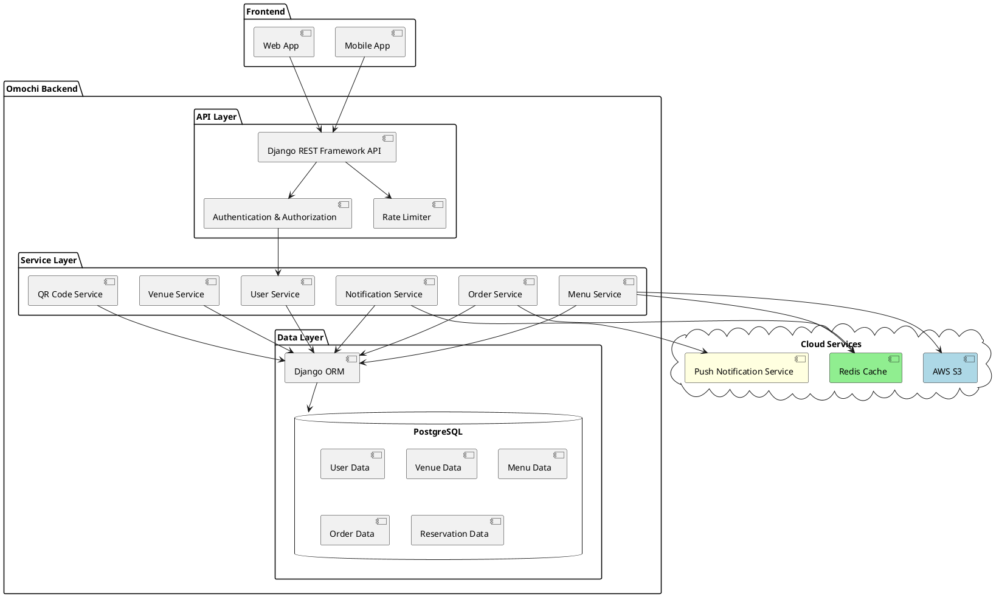
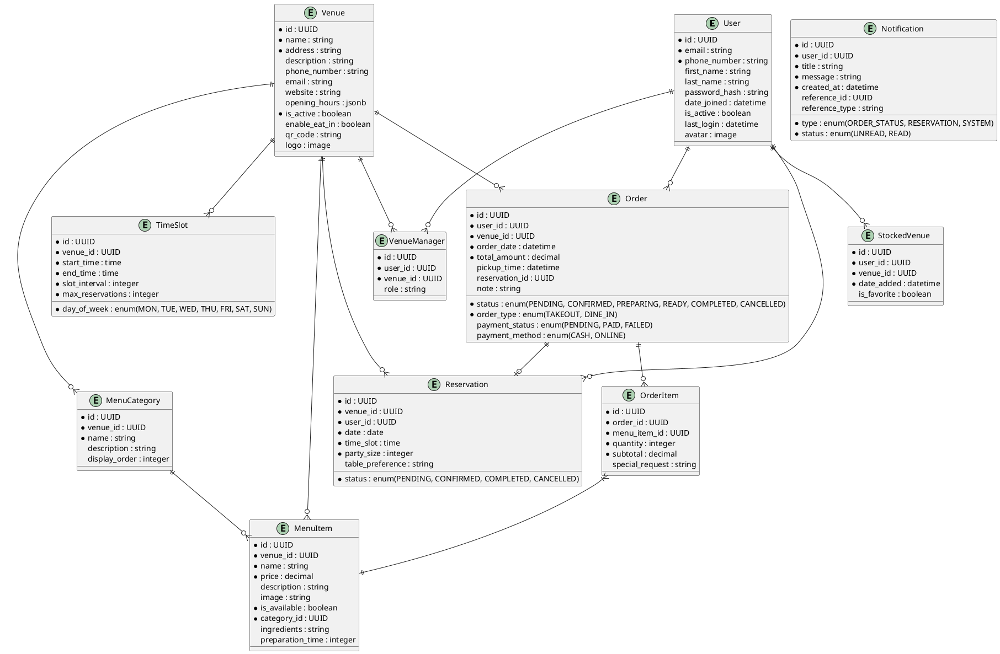

# Omochi Backend System Design

## 1. System Architecture Overview

The Omochi backend system is designed as a REST API-based architecture using Django and Django REST Framework (DRF). The system will handle QR-based ordering, user management, venue management, menu management, order processing, and real-time status updates.

### 1.1 Architecture Diagram



### 1.2 Technology Stack

- **Framework**: Django 4.2+ with Django REST Framework
- **Database**: PostgreSQL
- **Cache**: Redis
- **Task Queue**: Celery with Redis as broker
- **Authentication**: JWT (JSON Web Tokens)
- **Storage**: AWS S3 for media files (images)
- **Deployment**: Docker containers on AWS ECS
- **CI/CD**: GitHub Actions
- **Monitoring**: Prometheus + Grafana
- **Logging**: ELK Stack (Elasticsearch, Logstash, Kibana)

## 2. Data Models

### 2.1 Entity Relationship Diagram



### 2.2 Data Models Description

#### 2.2.1 User Model
Stores user authentication and profile information.

#### 2.2.2 Venue Model
Represents restaurants or food establishments in the system.

#### 2.2.3 VenueManager Model
Links users with venue management permissions.

#### 2.2.4 StockedVenue Model
Tracks venues that users have saved for future ordering.

#### 2.2.5 MenuCategory Model
Organizes menu items into categories.

#### 2.2.6 MenuItem Model
Individual food items available at venues.

#### 2.2.7 Order Model
Tracks customer orders with status.

#### 2.2.8 OrderItem Model
Individual items within an order.

#### 2.2.9 Reservation Model
Manages eat-in reservations.

#### 2.2.10 TimeSlot Model
Defines available time slots for reservations or order pickup.

#### 2.2.11 Notification Model
Handles user notifications.

## 3. API Design

### 3.1 API Endpoints

#### Authentication Endpoints
```
POST   /api/auth/register/                    # Register a new user
POST   /api/auth/login/                       # Login and get JWT token
POST   /api/auth/refresh-token/               # Refresh JWT token
POST   /api/auth/password-reset/              # Request password reset
POST   /api/auth/password-reset/confirm/      # Confirm password reset
GET    /api/auth/me/                          # Get current user profile
PUT    /api/auth/me/                          # Update user profile
```

#### Venue Endpoints
```
GET    /api/venues/                           # List venues (with filtering)
GET    /api/venues/{id}/                      # Get venue details
POST   /api/venues/                           # Create venue (admin only)
PUT    /api/venues/{id}/                      # Update venue (admin/manager)
DELETE /api/venues/{id}/                      # Delete venue (admin only)
GET    /api/venues/{id}/menu/                 # Get venue menu
GET    /api/venues/qr/{code}/                 # Get venue by QR code
```

#### Stocked Venues Endpoints
```
GET    /api/stocked-venues/                   # List user's stocked venues
POST   /api/stocked-venues/                   # Add venue to stocked venues
DELETE /api/stocked-venues/{id}/              # Remove venue from stocked venues
PUT    /api/stocked-venues/{id}/favorite/     # Toggle favorite status
```

#### Menu Endpoints
```
GET    /api/venues/{venue_id}/menu/categories/           # List menu categories
POST   /api/venues/{venue_id}/menu/categories/           # Create menu category
GET    /api/venues/{venue_id}/menu/categories/{id}/      # Get menu category
PUT    /api/venues/{venue_id}/menu/categories/{id}/      # Update menu category
DELETE /api/venues/{venue_id}/menu/categories/{id}/      # Delete menu category

GET    /api/venues/{venue_id}/menu/items/                # List menu items
POST   /api/venues/{venue_id}/menu/items/                # Create menu item
GET    /api/venues/{venue_id}/menu/items/{id}/           # Get menu item
PUT    /api/venues/{venue_id}/menu/items/{id}/           # Update menu item
DELETE /api/venues/{venue_id}/menu/items/{id}/           # Delete menu item
```

#### Order Endpoints
```
GET    /api/orders/                           # List user orders
POST   /api/orders/                           # Create order
GET    /api/orders/{id}/                      # Get order details
PUT    /api/orders/{id}/status/               # Update order status (venue)
DELETE /api/orders/{id}/                      # Cancel order
```

#### Reservation Endpoints
```
GET    /api/venues/{venue_id}/reservations/   # List venue reservations
POST   /api/venues/{venue_id}/reservations/   # Create reservation
GET    /api/reservations/{id}/                # Get reservation details
PUT    /api/reservations/{id}/                # Update reservation
DELETE /api/reservations/{id}/                # Cancel reservation
```

#### Time Slot Endpoints
```
GET    /api/venues/{venue_id}/time-slots/     # Get available time slots
POST   /api/venues/{venue_id}/time-slots/     # Create time slot (venue)
PUT    /api/venues/{venue_id}/time-slots/{id}/# Update time slot (venue)
DELETE /api/venues/{venue_id}/time-slots/{id}/# Delete time slot (venue)
```

#### QR Code Endpoints
```
POST   /api/venues/{venue_id}/generate-qr/    # Generate QR code for venue
GET    /api/venues/qr/{code}/                 # Get venue by QR code
POST   /api/venues/{venue_id}/share-qr/       # Generate sharing link
```

#### Notification Endpoints
```
GET    /api/notifications/                    # List user notifications
PUT    /api/notifications/{id}/read/          # Mark notification as read
DELETE /api/notifications/{id}/               # Delete notification
```

### 3.2 API Response Format

All API responses will follow this standard format:

```json
{
  "success": true,
  "data": { ... },
  "message": "Optional message",
  "errors": { ... }
}
```

## 4. Authentication & Authorization

### 4.1 Authentication Strategy
- JWT (JSON Web Tokens) based authentication
- Token expires after 1 hour (configurable)
- Refresh token with 30-day expiry

### 4.2 Authorization Strategy
Role-based access control with the following roles:
1. **Customer** - Regular users who place orders
2. **Venue Manager** - Manages venue details, menu, and orders
3. **Admin** - System administrators with full access

Permissions will be granular and associated with specific actions and resources.

## 5. Caching Strategy

### 5.1 Redis Caching
- Menu items and categories (5-minute TTL)
- Venue information (15-minute TTL)
- User preferences (30-minute TTL)

### 5.2 Database Query Optimization
- Proper indexing on frequently queried fields
- Denormalization where appropriate for read-heavy operations
- Query optimization with select_related and prefetch_related

## 6. Asynchronous Processing

### 6.1 Celery Tasks
- Email/SMS notifications
- Push notifications
- Order status updates
- Report generation
- Periodic clean-up tasks

## 7. Security Measures

### 7.1 Data Protection
- HTTPS for all API communications
- Database encryption for sensitive data (e.g., payment information)
- Password hashing with PBKDF2 and strong salt

### 7.2 Rate Limiting
- API rate limiting to prevent abuse
- Graduated rate limits based on endpoint sensitivity
- IP-based and token-based limiting

### 7.3 Input Validation
- Thorough request validation
- Protection against common security threats (XSS, CSRF, SQL Injection)
- Parameter sanitization

## 8. Monitoring & Logging

### 8.1 Monitoring
- Real-time performance monitoring with Prometheus
- System metrics visualization with Grafana
- Alert configuration for system anomalies

### 8.2 Logging
- Structured logging with ELK stack
- Log levels: DEBUG, INFO, WARNING, ERROR, CRITICAL
- Request/response logging for debugging
- Error tracking and reporting

## 9. Deployment Strategy

### 9.1 Docker Containerization
- Docker containers for each service
- Docker Compose for local development
- Kubernetes for production orchestration

### 9.2 CI/CD Pipeline
- GitHub Actions for continuous integration
- Automated testing on pull requests
- Automated deployment to staging and production

### 9.3 Environments
- Development (local)
- Testing (CI environment)
- Staging (pre-production)
- Production (live system)

## 10. Scaling Strategy

### 10.1 Horizontal Scaling
- Stateless API design for easy scaling
- Load balancing with AWS ALB
- Auto-scaling based on demand

### 10.2 Database Scaling
- Read replicas for heavy read operations
- Connection pooling
- Query optimization and indexing

## 11. Backup & Recovery

### 11.1 Database Backups
- Daily automated backups
- Point-in-time recovery capability
- Cross-region backup storage

### 11.2 Disaster Recovery
- High availability configuration
- Regular recovery drills
- Documented recovery procedures

## 12. Implementation Plan

### 12.1 Phase 1 (Sprint 1 - MVP Setup)
- User authentication system
- Venue management
- Basic QR code generation
- Stocked venues functionality

### 12.2 Phase 2 (Sprint 2 - Order Processing)
- Menu system
- Order creation and management
- Payment integration
- Basic notification system

### 12.3 Phase 3 (Sprint 3 - Enhancements)
- Eat-in reservation system
- QR code sharing
- Advanced filtering for stocked venues
- Performance optimization and scaling

## 13. Testing Strategy

### 13.1 Unit Testing
- Test each service function independently
- Achieve >80% code coverage

### 13.2 Integration Testing
- Test API endpoints with realistic scenarios
- Database integration tests

### 13.3 Load Testing
- Simulate high-traffic scenarios
- Identify and fix performance bottlenecks
- Test auto-scaling capabilities

## 14. API Documentation

API documentation will be generated using drf-yasg (Swagger/OpenAPI), providing interactive documentation for all endpoints, request parameters, and response models.

## 15. Conclusion

This backend system design for Omochi provides a robust foundation for the QR-based mobile ordering system. The design focuses on scalability, security, and performance to meet the business requirements outlined in the SRS document. The modular architecture allows for future expansion and feature additions as the platform grows.