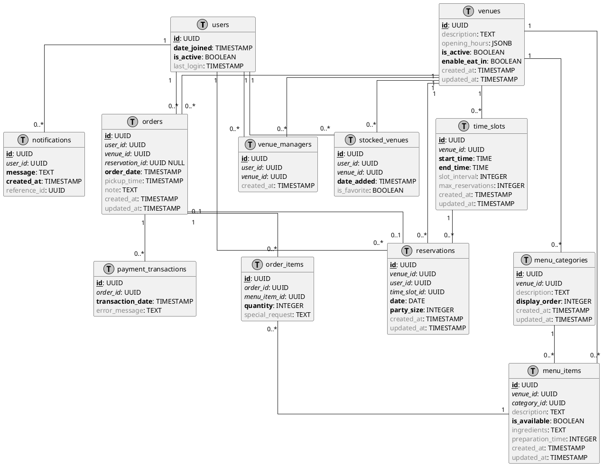

# Omochi Database Design

## 1. Overview

This document provides a detailed design of the database structure for the Omochi QR-Based Mobile Ordering System. It outlines tables, relationships, constraints, and indexes required to support the system's functionality including user management, venue management, menu management, ordering, and reservations.

## 2. Database Technology

- **Database Engine**: PostgreSQL 17
- **Character Set**: UTF-8
- **Collation**: Case-insensitive (for text searches)

## 3. Entity Relationship Diagram



## 4. Table Definitions

### 4.1 Users Table

Stores information about system users including customers, venue managers, and administrators.

| Column Name  | Data Type    | Constraints       | Description                         |
|--------------|--------------|-------------------|-------------------------------------|
| id           | UUID         | PK               | Unique identifier for the user       |
| email        | VARCHAR(255) | UNIQUE, NOT NULL | User's email address                 |
| phone_number | VARCHAR(20)  | UNIQUE, NOT NULL | User's phone number                  |
| password_hash| VARCHAR(255) | NOT NULL        | Hashed password                      |
| first_name   | VARCHAR(100) |                  | User's first name                    |
| last_name    | VARCHAR(100) |                  | User's last name                     |
| date_joined  | TIMESTAMP    | NOT NULL        | Date and time when user registered   |
| is_active    | BOOLEAN      | NOT NULL        | Flag indicating if user is active    |
| last_login   | TIMESTAMP    |                  | Time of last login                   |
| avatar       | VARCHAR(255) |                  | Path to user's profile image         |
| role         | ENUM         | NOT NULL        | User role (CUSTOMER, VENUE_MANAGER, ADMIN) |

#### Indexes
- PRIMARY KEY on `id`
- INDEX on `email`
- INDEX on `phone_number`

### 4.2 Venues Table

Stores information about restaurants and food establishments.

| Column Name    | Data Type    | Constraints       | Description                               |
|----------------|--------------|-------------------|-------------------------------------------|
| id             | UUID         | PK               | Unique identifier for the venue           |
| name           | VARCHAR(255) | NOT NULL        | Name of the venue                         |
| address        | VARCHAR(255) | NOT NULL        | Physical address of the venue             |
| description    | TEXT         |                  | Description of the venue                  |
| phone_number   | VARCHAR(20)  |                  | Contact phone number                      |
| email          | VARCHAR(255) |                  | Contact email address                     |
| website        | VARCHAR(255) |                  | Website URL                               |
| opening_hours  | JSONB        |                  | JSON object containing opening hours      |
| is_active      | BOOLEAN      | NOT NULL        | Flag indicating if venue is active        |
| enable_eat_in  | BOOLEAN      | NOT NULL        | Flag indicating if eat-in is available    |
| qr_code        | VARCHAR(255) | UNIQUE, NOT NULL | Unique QR code identifier                 |
| logo           | VARCHAR(255) |                  | Path to venue's logo image                |
| created_at     | TIMESTAMP    |                  | Creation timestamp                        |
| updated_at     | TIMESTAMP    |                  | Last update timestamp                     |

#### Indexes
- PRIMARY KEY on `id`
- INDEX on `name`
- UNIQUE INDEX on `qr_code`

### 4.3 Venue Managers Table

Links users to venues they manage.

| Column Name | Data Type | Constraints | Description                       |
|-------------|-----------|-------------|-----------------------------------|
| id          | UUID      | PK         | Unique identifier                  |
| user_id     | UUID      | FK, NOT NULL | Reference to users table           |
| venue_id    | UUID      | FK, NOT NULL | Reference to venues table          |
| role        | VARCHAR(50) |           | Specific management role           |
| created_at  | TIMESTAMP |            | Creation timestamp                 |

#### Indexes
- PRIMARY KEY on `id`
- INDEX on `user_id`
- INDEX on `venue_id`
- COMPOSITE INDEX on `(user_id, venue_id)`

### 4.4 Stocked Venues Table

Tracks venues that users have saved for future ordering.

| Column Name | Data Type | Constraints | Description                      |
|-------------|-----------|-------------|----------------------------------|
| id          | UUID      | PK         | Unique identifier                 |
| user_id     | UUID      | FK, NOT NULL | Reference to users table          |
| venue_id    | UUID      | FK, NOT NULL | Reference to venues table         |
| date_added  | TIMESTAMP | NOT NULL   | When the venue was added          |
| is_favorite | BOOLEAN   |            | Flag for favorite venues          |

#### Indexes
- PRIMARY KEY on `id`
- INDEX on `user_id`
- INDEX on `venue_id`
- COMPOSITE INDEX on `(user_id, venue_id)`

### 4.5 Menu Categories Table

Organizes menu items into categories.

| Column Name   | Data Type    | Constraints | Description                   |
|---------------|--------------|-------------|-------------------------------|
| id            | UUID         | PK         | Unique identifier              |
| venue_id      | UUID         | FK, NOT NULL | Reference to venues table      |
| name          | VARCHAR(255) | NOT NULL   | Category name                  |
| description   | TEXT         |            | Category description           |
| display_order | INTEGER      | NOT NULL   | Order for display              |
| created_at    | TIMESTAMP    |            | Creation timestamp             |
| updated_at    | TIMESTAMP    |            | Last update timestamp          |

#### Indexes
- PRIMARY KEY on `id`
- INDEX on `venue_id`

### 4.6 Menu Items Table

Individual food items available at venues.

| Column Name      | Data Type     | Constraints | Description                    |
|------------------|---------------|-------------|--------------------------------|
| id               | UUID          | PK         | Unique identifier               |
| venue_id         | UUID          | FK, NOT NULL | Reference to venues table       |
| category_id      | UUID          | FK, NOT NULL | Reference to menu_categories    |
| name             | VARCHAR(255)  | NOT NULL   | Item name                       |
| price            | DECIMAL(10,2) | NOT NULL   | Item price                      |
| description      | TEXT          |            | Item description                |
| image            | VARCHAR(255)  |            | Path to item image              |
| is_available     | BOOLEAN       | NOT NULL   | Flag if item is available       |
| ingredients      | TEXT          |            | Item ingredients                |
| preparation_time | INTEGER       |            | Preparation time in minutes     |
| created_at       | TIMESTAMP     |            | Creation timestamp              |
| updated_at       | TIMESTAMP     |            | Last update timestamp           |

#### Indexes
- PRIMARY KEY on `id`
- INDEX on `venue_id`
- INDEX on `category_id`
- INDEX on `is_available`

### 4.7 Orders Table

Tracks customer orders with status.

| Column Name     | Data Type     | Constraints | Description                      |
|----------------|---------------|-------------|----------------------------------|
| id             | UUID          | PK         | Unique identifier                 |
| user_id        | UUID          | FK, NOT NULL | Reference to users table          |
| venue_id       | UUID          | FK, NOT NULL | Reference to venues table         |
| reservation_id | UUID          | FK         | Reference to reservations table   |
| status         | ENUM          | NOT NULL   | Order status                      |
| order_type     | ENUM          | NOT NULL   | Type of order (TAKEOUT, DINE_IN)  |
| order_date     | TIMESTAMP     | NOT NULL   | When order was placed             |
| total_amount   | DECIMAL(10,2) | NOT NULL   | Total order amount                |
| payment_status | ENUM          | NOT NULL   | Payment status                    |
| payment_method | ENUM          |            | Method of payment                 |
| pickup_time    | TIMESTAMP     |            | Scheduled pickup time             |
| note           | TEXT          |            | Special notes for the order       |
| created_at     | TIMESTAMP     |            | Creation timestamp                |
| updated_at     | TIMESTAMP     |            | Last update timestamp             |

#### Indexes
- PRIMARY KEY on `id`
- INDEX on `user_id`
- INDEX on `venue_id`
- INDEX on `reservation_id`
- INDEX on `status`
- INDEX on `order_date`
- INDEX on `payment_status`

### 4.8 Order Items Table

Individual items within an order.

| Column Name     | Data Type     | Constraints | Description                   |
|----------------|---------------|-------------|-------------------------------|
| id             | UUID          | PK         | Unique identifier              |
| order_id       | UUID          | FK, NOT NULL | Reference to orders table      |
| menu_item_id   | UUID          | FK, NOT NULL | Reference to menu_items table  |
| quantity       | INTEGER       | NOT NULL   | Quantity ordered               |
| subtotal       | DECIMAL(10,2) | NOT NULL   | Price × quantity               |
| special_request| TEXT          |            | Special requests for item      |

#### Indexes
- PRIMARY KEY on `id`
- INDEX on `order_id`
- INDEX on `menu_item_id`

### 4.9 Reservations Table

Manages eat-in reservations.

| Column Name      | Data Type    | Constraints | Description                    |
|-----------------|--------------|-------------|--------------------------------|
| id              | UUID         | PK         | Unique identifier               |
| venue_id        | UUID         | FK, NOT NULL | Reference to venues table       |
| user_id         | UUID         | FK, NOT NULL | Reference to users table        |
| time_slot_id    | UUID         | FK, NOT NULL | Reference to time_slots table   |
| date            | DATE         | NOT NULL   | Reservation date                |
| party_size      | INTEGER      | NOT NULL   | Number of people                |
| status          | ENUM         | NOT NULL   | Reservation status              |
| table_preference| VARCHAR(100) |            | Preferred table or location     |
| created_at      | TIMESTAMP    |            | Creation timestamp              |
| updated_at      | TIMESTAMP    |            | Last update timestamp           |

#### Indexes
- PRIMARY KEY on `id`
- INDEX on `venue_id`
- INDEX on `user_id`
- INDEX on `time_slot_id`
- INDEX on `date`
- INDEX on `status`
- COMPOSITE INDEX on `(venue_id, date, status)`

### 4.10 Time Slots Table

Defines available time slots for reservations or order pickup.

| Column Name     | Data Type | Constraints | Description                     |
|----------------|-----------|-------------|---------------------------------|
| id             | UUID      | PK         | Unique identifier                |
| venue_id       | UUID      | FK, NOT NULL | Reference to venues table        |
| day_of_week    | ENUM      | NOT NULL   | Day of week                      |
| start_time     | TIME      | NOT NULL   | Start time                       |
| end_time       | TIME      | NOT NULL   | End time                         |
| slot_interval  | INTEGER   |            | Interval in minutes              |
| max_reservations| INTEGER  |            | Maximum reservations per slot    |
| created_at     | TIMESTAMP |            | Creation timestamp               |
| updated_at     | TIMESTAMP |            | Last update timestamp            |

#### Indexes
- PRIMARY KEY on `id`
- INDEX on `venue_id`
- COMPOSITE INDEX on `(venue_id, day_of_week)`

### 4.11 Notifications Table

Handles user notifications.

| Column Name    | Data Type    | Constraints | Description                      |
|---------------|--------------|-------------|----------------------------------|
| id            | UUID         | PK         | Unique identifier                 |
| user_id       | UUID         | FK, NOT NULL | Reference to users table          |
| title         | VARCHAR(255) | NOT NULL   | Notification title                |
| message       | TEXT         | NOT NULL   | Notification content              |
| type          | ENUM         | NOT NULL   | Type of notification              |
| status        | ENUM         | NOT NULL   | Read status                       |
| created_at    | TIMESTAMP    | NOT NULL   | Time notification was created     |
| reference_id  | UUID         |            | ID of related entity              |
| reference_type| VARCHAR(50)  |            | Type of related entity            |

#### Indexes
- PRIMARY KEY on `id`
- INDEX on `user_id`
- INDEX on `status`
- INDEX on `created_at`

### 4.12 Payment Transactions Table

Records payment transactions for orders.

| Column Name     | Data Type     | Constraints | Description                    |
|----------------|---------------|-------------|--------------------------------|
| id             | UUID          | PK         | Unique identifier               |
| order_id       | UUID          | FK, NOT NULL | Reference to orders table       |
| amount         | DECIMAL(10,2) | NOT NULL   | Transaction amount              |
| status         | ENUM          | NOT NULL   | Transaction status              |
| payment_method | VARCHAR(50)   | NOT NULL   | Method of payment               |
| transaction_date| TIMESTAMP    | NOT NULL   | When transaction occurred       |
| transaction_id | VARCHAR(100)  |            | External payment gateway ID     |
| payment_gateway| VARCHAR(50)   |            | Payment processor used          |
| error_message  | TEXT          |            | Error details if failed         |

#### Indexes
- PRIMARY KEY on `id`
- INDEX on `order_id`
- INDEX on `status`
- INDEX on `transaction_date`
- INDEX on `transaction_id`

## 5. Database Views

### 5.1 Active Venues View

```sql
CREATE VIEW active_venues AS
SELECT id, name, address, phone_number, email, qr_code, enable_eat_in
FROM venues
WHERE is_active = TRUE;
```

### 5.2 Menu Items With Categories View

```sql
CREATE VIEW menu_items_with_categories AS
SELECT 
    mi.id, 
    mi.name, 
    mi.price, 
    mi.description, 
    mi.is_available,
    mc.id as category_id, 
    mc.name as category_name,
    v.id as venue_id,
    v.name as venue_name
FROM menu_items mi
JOIN menu_categories mc ON mi.category_id = mc.id
JOIN venues v ON mi.venue_id = v.id;
```

### 5.3 Order Summary View

```sql
CREATE VIEW order_summary AS
SELECT 
    o.id, 
    o.order_date, 
    o.total_amount, 
    o.status,
    o.order_type,
    o.payment_status,
    u.id as user_id, 
    u.email as user_email,
    u.phone_number as user_phone,
    v.id as venue_id,
    v.name as venue_name,
    COUNT(oi.id) as item_count
FROM orders o
JOIN users u ON o.user_id = u.id
JOIN venues v ON o.venue_id = v.id
JOIN order_items oi ON o.id = oi.order_id
GROUP BY o.id, u.id, v.id;
```

## 6. Database Migration Strategy

1. **Initial Schema Creation**: Create base schema with tables defined above
2. **Seeding**: Insert initial required data (e.g., admin users)
3. **Version Control**: All schema changes tracked in migration files
4. **Backward Compatibility**: Maintain compatibility with existing data
5. **Testing**: Test migrations on staging environment before production

## 7. Indexing Strategy

1. **Primary Keys**: UUIDs for all tables
2. **Foreign Keys**: Index all foreign key columns 
3. **Search Optimization**: Index text columns used for searching
4. **Composite Indexes**: For frequently joined or filtered columns
5. **Performance Monitoring**: Regular review of slow queries

## 8. Database Security

1. **Access Control**: Role-based access to database objects
2. **Connection Security**: TLS encrypted connections
3. **Data Encryption**: Sensitive data encryption at rest
4. **Audit Trail**: Track changes to sensitive data
5. **Backup Security**: Encrypted backups

## 9. Backup and Recovery Plan

1. **Daily Full Backups**: Complete database backup daily
2. **Point-in-Time Recovery**: WAL archiving for PITR
3. **Retention Policy**: 30 days of backups retained
4. **Recovery Testing**: Monthly recovery drills
5. **Automated Verification**: Automated backup verification