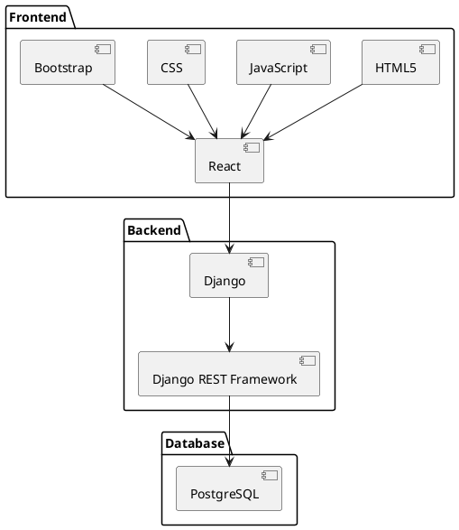

# Agile Business Requirements Document  
**“Omochi”**  
**Serendipity Inc.**  
**Document ver. 0.0.1**  

---

## Version History  

| Version | Approved by       | Revision Date | Description Change | Author            |
|---------|-------------------|---------------|--------------------|-------------------|
| 0.0.1   | Buddila Samarakoon | 2025/3/26     | Initial Draft      | Buddila Samarakoon |

---

## Project Overview  

### 1.1 Project Name  
**“Omochi” - QR-Based Mobile Ordering System**  

### 1.2 Vision  
“Omochi” is a web-based mobile ordering system designed to streamline takeout and eat-in experiences at restaurants. Users scan a venue-specific QR code, browse the menu, and place orders for pickup or dine-in (if available). The app also stores previously scanned venues, allows QR sharing, and supports future orders via a user’s saved restaurant list.  

### 1.3 Business Goals  
- Provide seamless ordering experience for customers through QR-based access.  
- Reduce order processing time for restaurants.  
- Enable venues to manage both takeout and eat-in reservations efficiently.  
- Create an efficient and scalable system capable of handling high traffic.  
- Support venue-driven customization (e.g., enabling or disabling eat-in, menu management).  
- Expand through user-driven growth by allowing QR sharing with friends and new users.  

### 1.4 Project Scope  

#### Included Features:  
- QR-based ordering for takeout and dine-in.  
- Stocked Venues – Users save past scanned venues for quick reorders.  
- QR Sharing – Users can share QR codes with others for easy ordering.  
- Filtering for Saved Venues – Users can search and filter stocked venues.  
- Dine-In Reservation Option – Venues control availability.  
- Venue-side menu and availability management.  
- Real-time order status updates.  

#### Excluded Features (Future Consideration):  
- Delivery service integration.  
- Table-side ordering via NFC or BLE.  
- Multi-location ordering (cross-restaurant shopping cart).  
- Advanced loyalty programs (basic order tracking will exist initially).  

---

## User Flow & System Structure  

### 2.1 User Flow Diagram  
Refer to attached file (`user_flow_omochi.xlsx`) for an image of the user flow.  

#### Step 1: QR Code Scanning & Login/Registration  
- **New Users:**  
  - Scan a restaurant’s unique QR code.  
  - App displays “Omochi” logo (2 seconds) → Redirects to Login/Registration page.  
  - Register using email, social login, or phone number.  
  - After logging in, the venue is added to Stocked Venues.  
- **Returning Users:**  
  - Scan a QR code → Instant access to the restaurant’s menu.  
  - If the restaurant has already been scanned before, it remains in Stocked Venues.  

#### Step 2: Order Selection  
- Users browse the venue’s menu.  
- If the venue allows Eat-In reservations, users select “Eat-In” or “Takeout”.  
  - **Eat-In Booking:**  
    - Choose the time slot.  
    - Optionally select table preferences (for future consideration).  
  - **Takeout Orders:**  
    - Select food items and set a pickup time from pre-set time slots.  

#### Step 3: Payment & Confirmation  
- Users pay online (if enabled by the venue) or choose cash on pickup.  
- Receive order confirmation & estimated wait time (show status/log on app).  
- Order is sent to the venue for processing.  

#### Step 4: Order Fulfillment  
- Venue updates order status (e.g., “In Progress,” “Ready for Pickup”).  
- Users receive push/email notifications when their order is ready.  
- For dine-in reservations, users check in at the restaurant upon arrival.  

#### Step 5: Pickup or Dine-In  
- **Takeout:** User shows confirmation code at pickup.  
- **Eat-In:** User is seated (using code), and their pre-ordered meal is prepared.  

#### Step 6: QR Sharing & Future Orders  
- Users can share a venue’s QR code via a unique link (works for non-users too).  
- Saved venues allow quick reordering.  
- Filtering by favorites, cuisine, or location helps users find past venues easily.  

### 2.2 System Architecture Diagram  
- **Frontend:** React.js (simple UI, mobile-first design).  
- **Backend:** Django (Django REST Framework - DRF, API-driven architecture).  
- **Database:** PostgreSQL (Cloud-hosted).  
- **Hosting:** AWS (for scaling and high availability).

### 2.3 System Architecture Diagram (PlantUML)

## User Stories & Features

### 3.1 User Personas

| Role               | Description                                                                 |
|--------------------|-----------------------------------------------------------------------------|
| Casual Customer    | A user who visits different restaurants and prefers quick, hassle-free ordering. Uses QR scanning for takeout and dine-in. |
| Regular Customer   | A returning user who saves and orders from stocked venues frequently. Prefers a personalized experience with filtering options. |
| Business Owner (Venue Manager)     | A restaurant owner or manager who manages orders, updates menu items, and controls eat-in reservation settings. |
| Admin              | A system administrator overseeing the platform, managing issues, handling disputes, and ensuring smooth operations. |

### 3.2 User Stories

#### User Side

| ID     | User Story                                                                 | Acceptance Criteria                                                                 | Priority |
|--------|-----------------------------------------------------------------------------|-------------------------------------------------------------------------------------|----------|
| US-001 | As a customer, I want to scan a QR code to instantly access the restaurant's menu, so I can place my order quickly. | Scanning a valid QR code displays the menu within 2 seconds.                        | High     |
| US-002 | As a customer, I want to log in or register after scanning a QR code, so I can save my previously visited venues. | Users are prompted to log in after the Omochi logo animation.                       | High     |
| US-003 | As a customer, I want to save my past scanned venues in "Stocked Venues," so I can quickly reorder in the future. | The system automatically saves scanned venues and allow filtering.                                      | High     |
| US-004 | As a customer, I want to share a restaurant’s QR code with my friends, so they can also place an order. | QR codes can be shared via a link, and non-registered users can open the menu.      | Medium   |
| US-005 | As a customer, I want to choose between takeout or eat-in if the venue allows, so I can decide how I receive my food. | Venues that enable eat-in allow users to choose between takeout and dine-in before ordering. | High     |
| US-006 | As a customer, I want to book a time slot for dine-in, so I can reserve a table and pre-order food. | Users can select available dine-in slots and confirm reservations.                  | Medium   |
| US-007 | As a customer, I want to receive real-time updates on my order status, so I know when to pick up my food. | The system sends order status notifications via push or email.                      | High     |

#### Venue Side

| ID     | User Story                                                                 | Acceptance Criteria                                                                 | Priority |
|--------|-----------------------------------------------------------------------------|-------------------------------------------------------------------------------------|----------|
| US-008 | As a venue manager, I want to create a menu and edit items, so I can keep my offerings up to date. | Managers can add, remove, and edit menu items in the admin panel.                   | High     |
| US-009 | As a venue manager, I want to enable or disable eat-in reservations, so I can control my restaurant’s availability. | Eat-in settings can be toggled on/off in the admin panel.                           | High     |
| US-010 | As a venue manager, I want to update order status (e.g., "Ready for Pickup"), so customers know when to pick up their orders. | Status updates are reflected in real-time in the user's app.                        | High     |

#### Admin Side

| ID     | User Story                                                                 | Acceptance Criteria                                                                 | Priority |
|--------|-----------------------------------------------------------------------------|-------------------------------------------------------------------------------------|----------|
| US-011 | As an admin, I want to oversee all restaurant activity, so I can ensure smooth platform operations. | The admin dashboard shows all restaurant activity and orders.                       | Medium   |
| US-012 | As an admin, I want to resolve order disputes between customers and venues, so issues can be handled effectively. | Admins can flag, review, and manage disputes.                                       | Medium   |

## Functional & Non-Functional Requirements

### 4.1 Functional Requirements

| ID     | Requirement Description                                                    |
|--------|-----------------------------------------------------------------------------|
| FR-001 | QR-Based Access: Users scan venue-specific QR codes to access menus.       |
| FR-002 | User Registration & Login: Users must log in or register before placing orders. |
| FR-003 | Menu & Ordering System: Restaurants provide menus, users add items to their cart and submit orders. |
| FR-004 | Eat-In Booking: Venues can enable Eat-In reservations, allowing users to pick a time slot. |
| FR-005 | Order Status Updates: Venues can update order status (e.g., In Progress, Ready for Pickup). |
| FR-006 | QR Code Sharing: Users can share restaurant QR codes with others (non-users included). |
| FR-007 | Stocked Venues: Users’ previously scanned venues are stored for future ordering. |

### 4.2 Non-Functional Requirements

| ID     | Requirement Description                                                    |
|--------|-----------------------------------------------------------------------------|
| NFR-001 | Performance: The system should process API requests within 2 seconds.     |
| NFR-002 | Security: Role-based access control (RBAC) for venues & admin access.     |
| NFR-003 | Scalability: Should support 1M+ active users per month.                   |
| NFR-004 | Caching Strategy: Redis caching for frequent queries (menu retrieval).    |
| NFR-005 | API Rate Limiting: Limits excessive API calls to prevent abuse.           |

## Technical Considerations

### 5.1 Key Considerations

- **Performance Optimization:**
  - API calls should respond within 2 seconds.
  - Use CDN caching for frequently accessed static content.
- **Scalability:**
  - System should handle 1M+ active users per month.
  - Implement load balancing with AWS Auto Scaling.
- **Security:**
  - Use secure API access (OAuth2 & JWT).
  - Role-based access control (RBAC) for customers, venues, and admins.
  - Implement rate limiting to prevent abuse.
- **Data Privacy & Compliance:**
  - Ensure GDPR compliance for user data storage and processing.
  - Anonymize user location data after order completion.

## Risk & Constraints

### 6.1 Risks

| Risk                          | Impact | Mitigation Strategy                                                              |
|-------------------------------|--------|----------------------------------------------------------------------------------|
| High traffic causing slow load times | High   | AWS Auto Scaling & database optimization                                        |
| High traffic ramping up server/hosting cost | High   | Optimize API usage and caching to reduce redundant usage.                        |
| Order errors                  | Medium | Allow venues to edit/cancel orders within 10 minutes with notification to users. |
| Security threats (data leaks, unauthorized access) | High   | Enforce authentication (OAuth2 & JWT).                                          |
| Fraudulent orders/failed orders | High   | Require registration of telephone number and credit card info for conflict resolution. |

### 6.2 Constraints

- **Budget:** Initial deployment budget of ¥1,000,000 – 1,500,000.
- **Timeline:** MVP launch within 1.5 months, test with venue and full launch in 2 months (June).
- **GDPR Compliance:** User location & order history must follow privacy regulations.

## Agile Development Plan

### 7.1 Sprint Planning

| Sprint   | Goals                          | Features Covered                                                                |
|----------|--------------------------------|----------------------------------------------------------------------------------|
| Sprint 1 | MVP Setup                      | QR scanning, login/register, venue stocking                                     |
| Sprint 2 | Order Processing               | Menu system, cart, payment options                                              |
| Sprint 3 | Enhancements                   | Eat-In reservations, QR sharing, filtering                                      |

### 7.2 Definition of Done

- Fully functional API with QR scanning, ordering, and reservations.
- Frontend UI ready for public use.
- Security & performance benchmarks met.
- No critical issues in testing phase.

